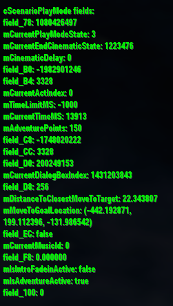

# Debug Window
A Spore (2008) mod that adds a debug information window to the game. This was originally part of the Adventure Checkpoints mod during development, but it was separated from it before full release.

Currently the only supported gamemode is GA's adventure play mode, but there are plans to support other game modes in the future as well.

### How to use?
There are two ways to enable the window: Use keybind `ALT+D` or type the cheat `debugWindow` into Spore's cheat console (`CTRL+SHIFT+C`).